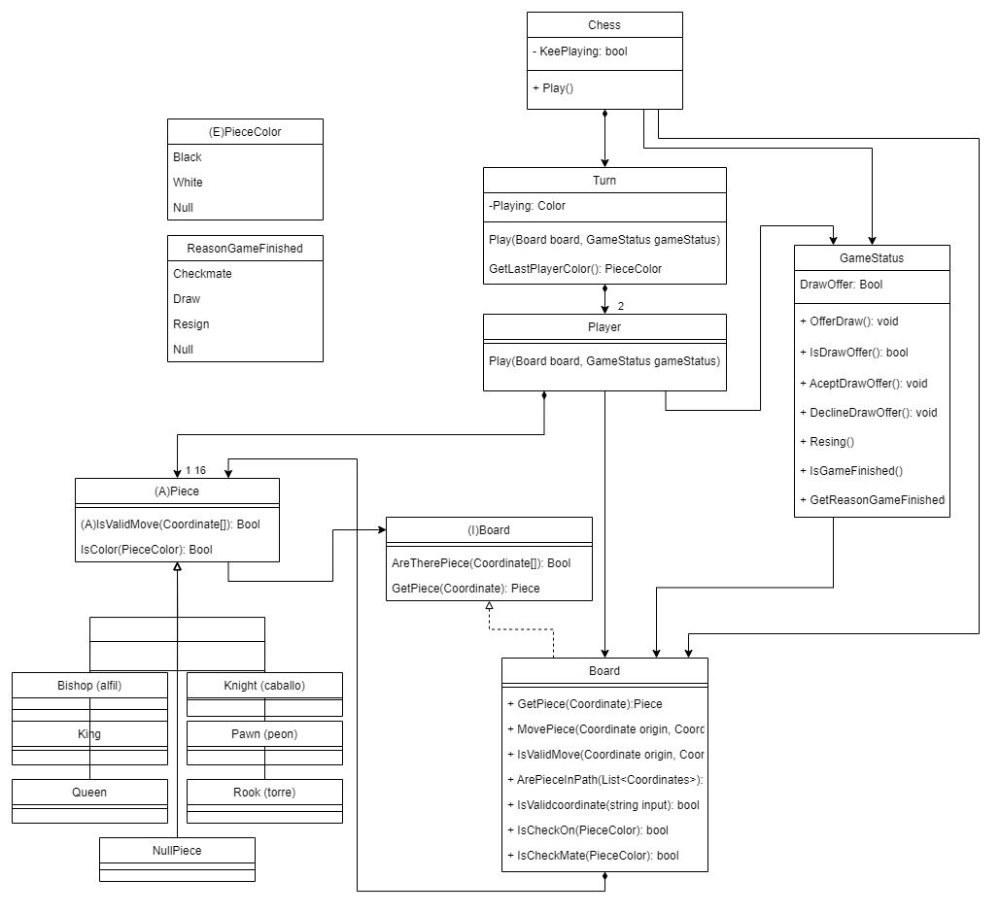

# Chess

### Description
In this first version, we have developed chess with the models taking on all responsibility, controlling input and output of data coupled to the console (view), business logic (model), and controller, while trying to maintain good design and avoiding cycles.

Basic game for two players.

## Use Cases
- New game
- Move
- Resign
- Offer/Accept draw

---


## Design diagram



## Interface Prototype
```
        ##CHESS##

Que comience el ajedrez
  A B C D E F G H
8 ♜ ♞ ♝ ♛ ♚ ♝ ♞ ♜ 8
7 ♟ ♟ ♟ ♟ ♟ ♟ ♟ ♟ 7
6 -  -  -  -  -  -  -  - 6
5 -  -  -  -  -  -  -  - 5
4 -  -  -  -  -  -  -  - 4
3 -  -  -  -  -  -  -  - 3
2 ♙ ♙ ♙ ♙ ♙ ♙ ♙ ♙ 2
1 ♖ ♘ ♗ ♕ ♔ ♗ ♘ ♖ 1
  A  B  C  D  E  F G  H
```


## Author Info

- Linkedin - [Federico Andrés Jácome Castañeda](https://www.linkedin.com/in/federicojacome/)
- Website - [Portfolio](http://fedeandresdeveloper.online/)

[Back To The Top](#Chess)
