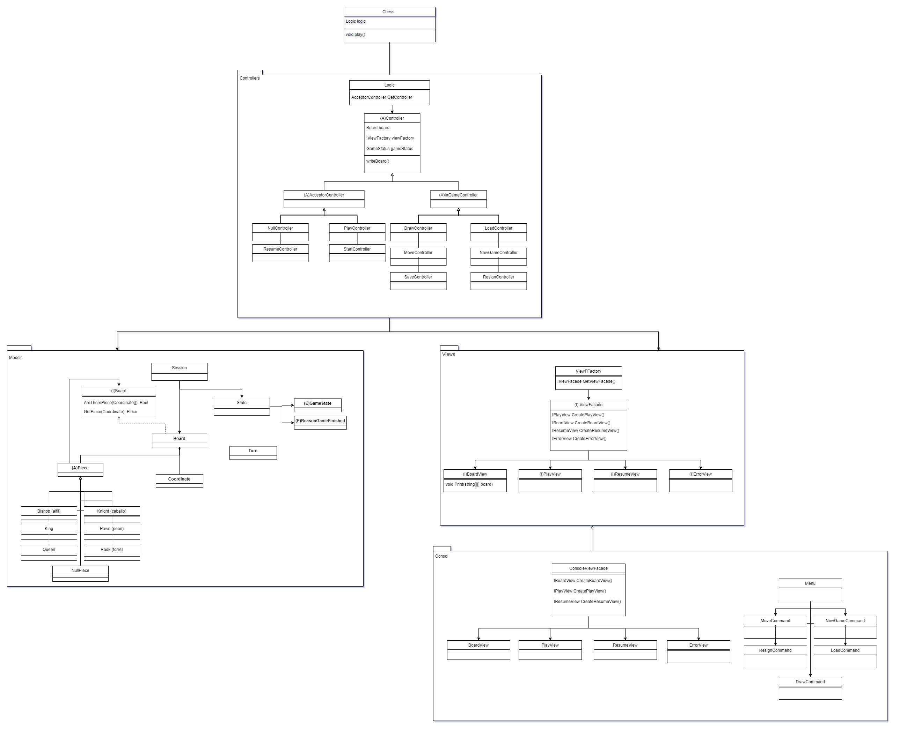

# Chess

### Description
Chess game using an MCV Passive View architecture made reducing the behavior of the UI components to the absolute minimum by using a controller that not just handles responses to user events, but also does all the updating of the view. The primary driver for Passive View is testing.
The views are open to diferent implementations using **Facade** and **Factory* Method** and the menus are handled using **Command** design pattern. In this game algo implement Save/Load use case using a **Repository pattern**

[Martin Fawler's blog: MVC Pasive view](https://martinfowler.com/eaaDev/PassiveScreen.html)

---

## Use Cases

- New Game
- Save/Load Game

- Move
- Resign
- Offer/Accept Draw

---


## Design diagram
Architecture diagram:


Design diagram



## Interface Console Prototype
```
        ##CHESS##

Que comience el ajedrez
  A B C D E F G H
8 ♜ ♞ ♝ ♛ ♚ ♝ ♞ ♜ 8
7 ♟ ♟ ♟ ♟ ♟ ♟ ♟ ♟ 7
6 -  -  -  -  -  -  -  - 6
5 -  -  -  -  -  -  -  - 5
4 -  -  -  -  -  -  -  - 4
3 -  -  -  -  -  -  -  - 3
2 ♙ ♙ ♙ ♙ ♙ ♙ ♙ ♙ 2
1 ♖ ♘ ♗ ♕ ♔ ♗ ♘ ♖ 1
  A  B  C  D  E  F G  H
```


## Author Info

- Linkedin - [Federico Andrés Jácome Castañeda](https://www.linkedin.com/in/federicojacome/)
- Website - [Portfolio](http://fedeandresdeveloper.online/)

[Back To The Top](#Chess)
