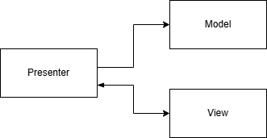
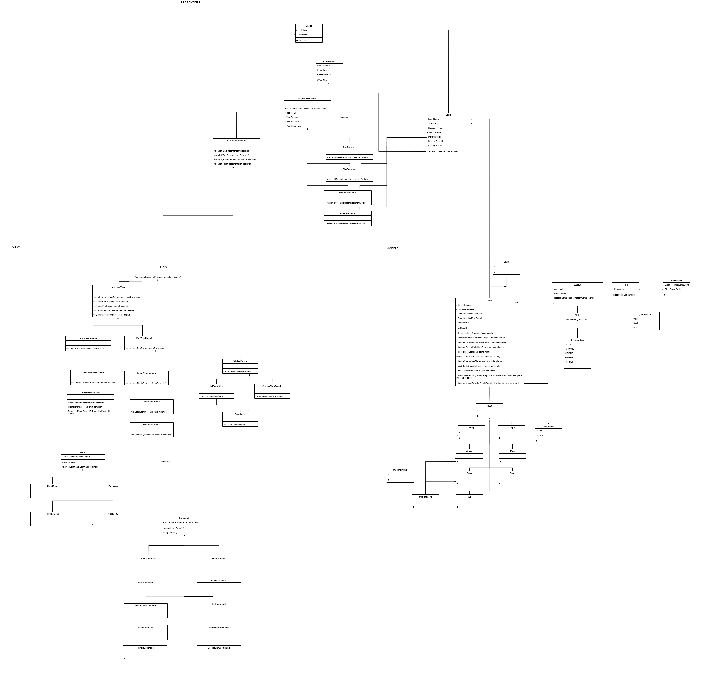

# Chess

### Description
Chess game implementing a **Model-View-Presenter (MVP)** architecture, where the **View** communicates directly with the **Presenter**, which acts as a mediator between the View and the **Model**. The **business logic** resides in the Model, while the **Presenter** handles the data flow and interaction between the View and the Model.

### Design Patterns
To enhance maintainability, flexibility, and testability, the project leverages the following **design patterns**:

- **Factory Pattern**: Manages dependencies, ensuring modularity and easy configuration.
- **Visitor Pattern**: Decouples actions performed on complex structures, enabling extensibility without modifying existing code.
- **Command Pattern**: Adheres to the **Open/Closed Principle**, encapsulating requests as objects to support undo functionality and flexible execution.
- **Repository Pattern**: Abstracts and decouples data access and persistence, making the application more adaptable to different storage mechanisms.

### Testing
The project includes comprehensive **unit tests** using **xUnit**, ensuring the correctness of business logic, Presenter behavior, and overall system reliability.


---

## Use Cases

- New Game
- Save/Load Game

- Move
- Resign
- Offer/Accept Draw

---


## Design diagram
Architecture diagram:



Design diagram



## Interface Console Prototype
```
        ##CHESS##

Que comience el ajedrez
  A B C D E F G H
8 ♜ ♞ ♝ ♛ ♚ ♝ ♞ ♜ 8
7 ♟ ♟ ♟ ♟ ♟ ♟ ♟ ♟ 7
6 -  -  -  -  -  -  -  - 6
5 -  -  -  -  -  -  -  - 5
4 -  -  -  -  -  -  -  - 4
3 -  -  -  -  -  -  -  - 3
2 ♙ ♙ ♙ ♙ ♙ ♙ ♙ ♙ 2
1 ♖ ♘ ♗ ♕ ♔ ♗ ♘ ♖ 1
  A  B  C  D  E  F G  H
```


## Author Info

- Linkedin - [Federico Andrés Jácome Castañeda](https://www.linkedin.com/in/federicojacome/)
- Website - [Portfolio](https://federocky.github.io/PersonalWeb/)

[Back To The Top](#Chess)
