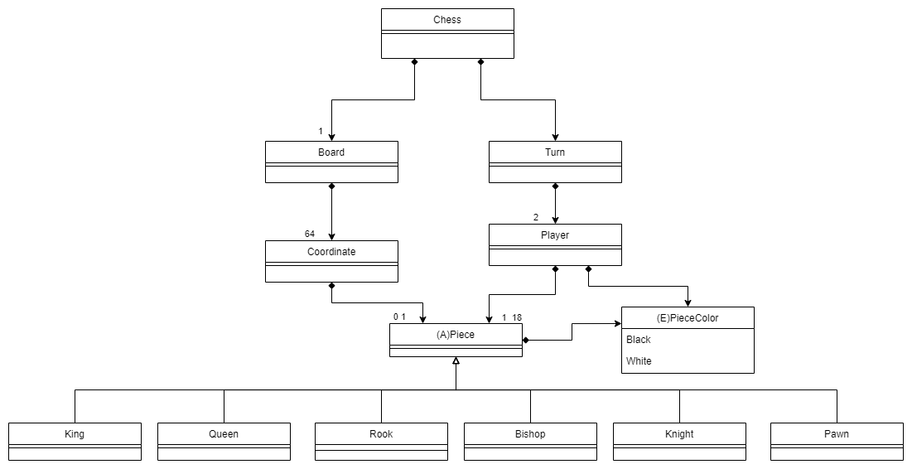

# Chess

### Description
Chess game programmed in .NET. The idea is to initially have the "Domain model" with the basic game, coupled to the console from the models, and with minimal functionality essential for two players. From there, transition to an MVC version, decoupling views, controllers, and models, and perhaps experimenting with a different MV*. Implement unit tests, apply some design patterns with some extra functionality like undo redo, implement data persistence, and finally adapt it to clean architectures such as clean architecture and finish with hexagonal architecture.

It's a practice to apply the various courses I have been taking lately on Design Patterns, Software Testing, and Architectures.

---

## Versions

- **Domain model:** Basic game for two players coupled to the console from the models.
- **MVC Passive view:** Variation of MVC reducing the behavior of the UI components to the absolute minimum by using a controller that not just handles responses to user events, but also does all the updating of the view. In this version we use Factory, Facade and Command design pattern to decouple the views and handle menus, implement some unit test and save/load functionality decoupled through repository pattern.

### More information:
[Martin Fawler's blog: MVC Pasive view](https://martinfowler.com/eaaDev/PassiveScreen.html)

---

## Domain model diagram

## Author Info

- Linkedin - [Federico Andrés Jácome Castañeda](https://www.linkedin.com/in/federicojacome/)
- Website - [Portfolio](https://federocky.github.io/PersonalWeb/)

[Back To The Top](#Chess)
